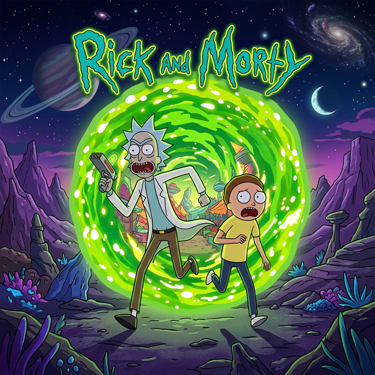

<div align="center">
  
  <h1>🌌 Multiverse Explorer</h1>
  <p>Una aplicación <strong>Premium</strong> para explorar, buscar y clasificar los infinitos especímenes del multiverso de Rick and Morty.</p>
</div>

---

## 🚀 Instalación y Despliegue

La aplicación fue construida utilizando `pnpm` para un manejo de paquetes ultra-rápido.

1. **Clonar e instalar dependencias**:
    ```bash
    pnpm install
    ```
2. **Iniciar la simulación del multiverso (Dev Server)**:
    ```bash
    pnpm run dev
    ```
3. **Explorar**: Abre tu navegador en `http://localhost:5173`

---

## 💎 Características Premium (UI/UX)

- **Diseño Glassmorphism**: Interfaz con efectos de cristal borroso (`backdrop-blur`), elevaciones 3D e iluminaciones estilo "neón radiactivo".
- **Splash Screen Cinemático**: Animaciones SVG, pulse effects y barras de sincronización al arrancar la app.
- **Micro-interacciones**: Skeletons animados con efecto "Shimmer" de alto rendimiento para mejorar los Core Web Vitals (FCP/LCP).
- **Cards Dinámicas 3D**: Tarjetas de personajes con sombras envolventes y transformaciones al pasar el ratón.
- **Empty States Inteligentes**: Respuestas visuales limpias (cero errores) cuando una búsqueda en una dimensión está vacía.

---

## 🧠 Arquitectura y Excelencia Técnica

El proyecto ha sido rigurosamente estructurado bajo los principios de **Clean Architecture (Hexagonal)**:

- 📂 **Core**: Modelos de datos estandarizados e interfaces (`Entities`).
- 📂 **Application**: Lógica de negocio orquestada en Custom Hooks (`useCharacters`, `useFavorites`, `useDebounce`).
- 📂 **Infrastructure**: Capa de acceso a datos (Patrón Repository) y Fetch API client abstraído.
- 📂 **UI**: Diseño dirigido por componentes modulares (Atomic Design: Atoms, Molecules, Organisms, Pages).

### Diferenciadores Técnicos (Bonus Implementados)

✨ **1. React Query (Advanced Caching & Memoization)**  
Se configuró `TanStack Query` con `staleTime` y `gcTime` prolongados. Si el usuario navega a un detalle o a sus favoritos y presiona "Atrás", la información se sirve de la memoria caché en **0ms**. Evitamos el re-fetch innecesario.

✨ **2. Infinite Scroll Navis**  
Se reemplazó la anticuada paginación de botones por un hook de `useInfiniteQuery` sumado a un `IntersectionObserver` nativo. Los personajes cargan proactivamente a medida que te desplazas hacia el fondo del abismo interdimensional.

✨ **3. Debounce Engine**  
Busca en tiempo real sin sobrecargar la API. Los inputs retrasan inteligentemente la búsqueda automatizada `500ms` después de la última pulsación, ahorrando ancho de banda masivo.

✨ **4. Persistencia Continua**  
El hook de favoritos intercepta interacciones y sincroniza directamente con `localStorage` de forma reactiva, asegurando que los especímenes marcados sigan ahí al recargar.

✨ **5. Batched Episode Requests**  
La vista de detalle de personaje toma las 50 URLs separadas que devuelve la API y las empaqueta en **1 sola petición de array** (`/episode/[1,2,3...50]`) hacia al backend, bajando el tiempo de carga dramáticamente.

---

## 🧪 Testing Automatizado

La aplicación cuenta con cobertura de test unitarios implementados con **Vitest + React Testing Library**.

Para correr las pruebas:
```bash
npx vitest run
```

Pruebas maestras incluidas:
- ✅ **List renders**: Evalúa (con una respuesta interceptada/mockeada) que React Query y la UI pueden pintar y resolver los componentes en el DOM.
- ✅ **Favorites persists**: Verifica y aísla la lógica computacional del Hook, confirmando el almacenamiento nativo en `localStorage`.

---

## ♿ Accesibilidad (A11y) & Performance

- **Semantic HTML**: Jerarquía impecable (`main`, `article`, `header`, `h1-h2`).
- **Focus States**: Botones y Cards accesibles vía Tabulador `Tab` con feedback visual táctico.
- **Image Optimization**: Manejo dinámico de Skeleton a Imagen, con etiquetas alt auto-descriptivas.
- **Responsive-First**: CSS Grid matemático adaptándose desde móviles hasta pantallas ultra panorámicas.

---
> *"Get in the ship, Morty! We've got a React app to build!"* - Rick Sanchez
